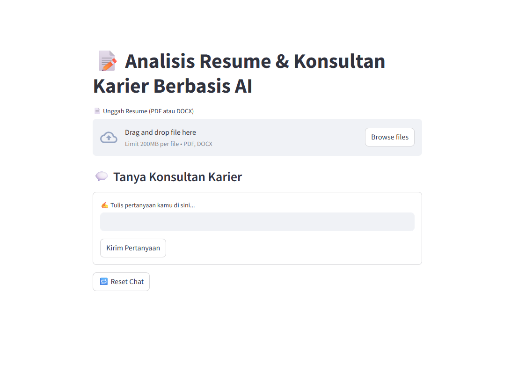
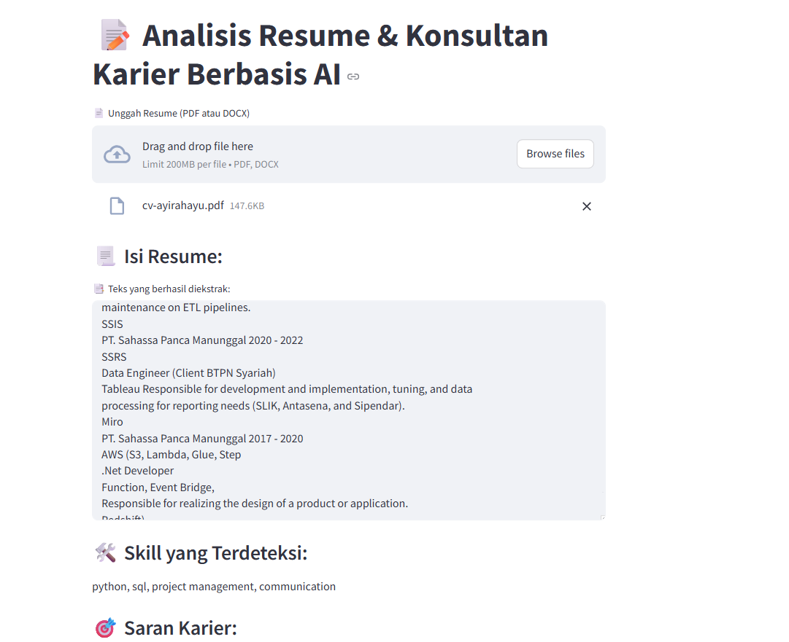
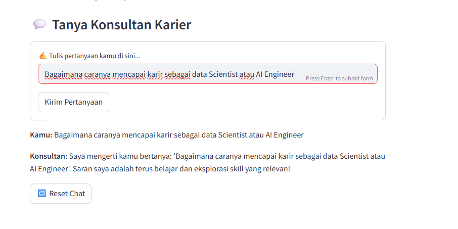

# 📝 Aplikasi Analisis Resume & Konsultan Karier Berbasis AI

  
  

---

## 🚀 Apa Itu Aplikasi Ini?

Aplikasi ini dirancang untuk membantu kamu menganalisis resume atau CV dengan cepat menggunakan teknologi **Artificial Intelligence (AI)**. Cukup unggah resume dalam format PDF atau DOCX, dan aplikasi akan secara otomatis:

- 📄 Mengekstrak isi teks dari dokumen  
- 🔍 Mendeteksi skill utama yang kamu miliki  
- 🎯 Memberikan rekomendasi karier yang relevan berdasarkan skill tersebut  
- 💬 Menyediakan fitur chat interaktif sebagai konsultan karier sederhana untuk menjawab pertanyaan kamu  

Semua ini bertujuan membantu kamu memahami potensi dan memberikan arahan karier yang tepat, baik untuk pencari kerja, profesional HR, atau konsultan karier.

---

## 🎉 Coba Langsung!

Jangan cuma baca, langsung coba aplikasinya di sini:  
👉 [https://app-resume.streamlit.app/](https://app-resume.streamlit.app/) 👈

---

## ✨ Fitur Utama

| Fitur                     | Deskripsi                                     | Icon    |
|---------------------------|-----------------------------------------------|---------|
| Upload Resume             | Terima file PDF & DOCX                         | 📂      |
| Ekstraksi Teks Otomatis  | Mengambil semua isi resume secara akurat      | 📝      |
| Deteksi Skill Sederhana  | Mengenali skill penting seperti Python, SQL, Machine Learning, Project Management, dll. | 🛠️      |
| Saran Karier Otomatis    | Rekomendasi profesi berdasarkan skill terdeteksi | 🎯      |
| Chat Konsultan Karier    | Tanya jawab interaktif yang memberikan tips karier langsung di aplikasi | 💬      |
| UI Sederhana & Responsif | Mudah digunakan oleh semua kalangan           | 📱      |

---

## 📸 Tampilan Aplikasi

  
*Halaman utama upload resume dan hasil analisis skill*

  
*Chat interaktif dengan konsultan karier sederhana*

---

## 🛠️ Status Pengembangan

Aplikasi ini masih dalam tahap pengembangan aktif. Fitur inti sudah berjalan dengan baik, dan rencana ke depan meliputi:

- Integrasi model AI yang lebih canggih untuk analisis skill dan pengalaman  
- Penambahan fitur scoring kompetensi resume  
- Personalisasi saran karier berdasarkan profil pengguna  
- Pengembangan antarmuka chat yang lebih interaktif dan pintar  

---

## 💡 Kenapa Harus Coba?

- **Praktis** — Analisis resume tanpa perlu ahli  
- **Cepat** — Hasil langsung didapat dalam hitungan detik  
- **Gratis & Terbuka** — Bisa langsung coba tanpa biaya dan source code tersedia untuk pengembangan  
- **Membantu Karier** — Mendapat insight berguna untuk langkah karier berikutnya  

---

## 🤝 Kontribusi

Saya sangat menyambut kontribusi dan masukan dari komunitas! Jika kamu punya ide, bug report, atau fitur baru, silakan ajukan *pull request* atau *issue* di repo ini.

---

## 🔗 Link Aplikasi dan Repo

Coba aplikasi langsung di:  
👉 [https://app-resume.streamlit.app/](https://app-resume.streamlit.app/) 👈

---

Terima kasih sudah mampir dan semoga aplikasi ini bisa membantu perjalanan karier kamu! 🌟  
Selamat mencoba dan selamat berkembang! 🚀

---

*Dikembangkan dengan 💡 dan passion oleh Ayi Rahayu*
